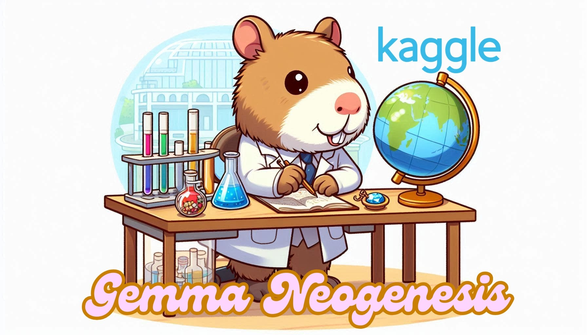

# 💎🌍🇮🇹 Gemma Neogenesis
**Improving Gemma 2 for a Specific Language on a Budget: Post-Training Recipe**

Additional resources for Gemma Neogenesis, a [📓 Kaggle notebook for improving Gemma 2 for a specific language on a budget](https://www.kaggle.com/code/anakin87/post-training-gemma-for-italian-and-beyond).
The notebook participates to the Kaggle competition: [Google - Unlock Global Communication with Gemma](https://www.kaggle.com/competitions/gemma-language-tuning).

## Notebook intro
The notebook demonstrates a case study on improving Gemma 2 2B's performance in Italian through Post-Training, combining Supervised Fine Tuning and Preference Tuning. The process uses both existing datasets and synthetic data generated specifically for this competition.
While focused on Italian, the cost-effective methods demonstrated can inspire similar fine-tuning approaches for other languages.

## 👣 Navigating this repository
- [📝 Evaluation Prompts](./evaluation_prompts/README.md): prompts for evaluating the quality of translated instructions and responses, using an LLM as a Judge, in the context of LLM-aided translation.
- [👁️ Qualitative Evaluation/Vibe Checking](./qualitative_evaluation): qualitative evaluation of the model, compared to gemma-2-2b-it on about10 varied questions/tasks.
- [🌐⚙️ Scale Translation](./scale_translation/README.md): code for scaling LLM-aided-translation.
- [🎯 Spectrum results](./spectrum_results): results of the Signal to Noise Ratio analysis done with Spectrum.
- [📚 References](./references.md): curated collection of resources and references used in the notebook.
- [🖼️ Images](./images/).
